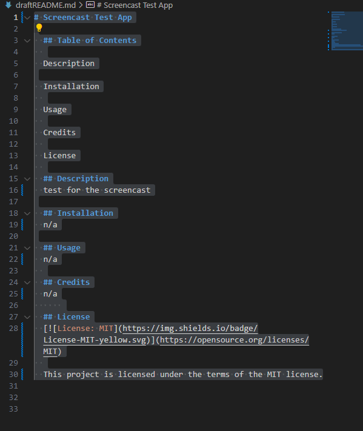

 

  # Adam Johnson Portfolio
 
  
 
  ## Table of Contents
  
  [Description](#description)

  [Installation](#installation)
  
  [Usage](#usage)

  [Contribute](#contribute)

  [Test](#test)
  
  [Credits](#credits)
  
  [License](#license)

  [Questions](#questions)
  
  ## Description
  This is a portfolio, built from scratch using React to render the page. Potential employers and collaborators can explore my portfolio, learn about me, view projects that I have worked on, and view/download my resume."

  ## Installation
  This application runs using the npm packages for React, including React DOM, React Scripts, and React Tooltips, and was deployed with the gh-pages Dev Dependency."

  ## Usage
  Portoflio visitors can click on the tabs in the navigation bar in the header to view the About Me, Portfolio, Contact, and Resume pages. On the portfolio page, users can click on the screenshot of each portfolio item to be taken to the corresponding deployed application, or alternatively, they can click on the text box to be taken to the corresponding github repo. In the Contact page, users can write at message to Adam including their email. This is not fully functional at this time. On the Resume page, users  can read my resume and download a pdf.

  
  
  
  ## Contribute
  N/A

  [GitHub Repo: (https://github.com/)]

  ## Test
  N/A
  
  ## Credits
  Much of the React code came from inclass examples from Bootcamp Spot's Fullstack Flex Bootcamp, Module-20.

  ## License
  
  
  
  This project is licensed under the terms of the MIT license.

  ## Questions?

  Contact me at:

  GitHub: https://github.com/AdamJohnson92
  
  email: adamgjohnson92@gmail.com
  
