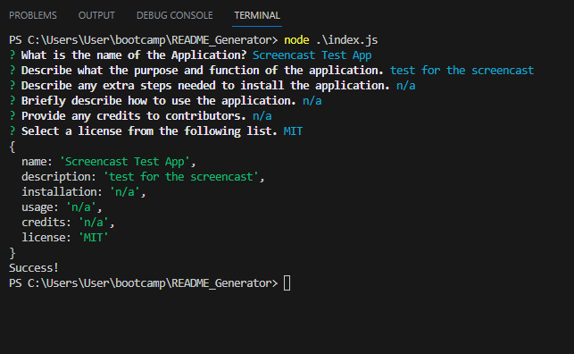

 

  # Mongo Social Network
 
  
 
  ## Table of Contents
  
  [Description](#description)

  [Installation](#installation)
  
  [Usage](#usage)

  [Contribute](#contribute)

  [Test](#test)
  
  [Credits](#credits)
  
  [License](#license)

  [Questions](#questions)
  
  ## Description
  These are the backend api routes for updateing a MongoDB database using Mongoose.

  ## Installation
  Requires NodeJS, ExpressJS, and Mongoose.

  ## Usage
  These API routes can all be tested in API testing software such as Insomnia. You can add, update, read, and delete Users and their Thoughts from a hypothetical social media website. You can also add and delete reactions, which are like comments that can be placed on a specific thought.

  
  
  
  ## Contribute
  

  [GitHub Repo: (https://github.com/)]

  ## Test
  
  
  ## Credits
  Many model and controller templates used came from BCS Unit 18 inclass exercises. Asssistance with seeding the database, courtesy of BCS instructor Rebecca Goldstien, and assistance with creating the Reaction post and delete routes courtesy of BCS tutor Jehyun Jung

  ## License
  
  
  
  This project is licensed under the terms of the MIT license.

  ## Questions?

  Contact me at:

  GitHub: https://github.com/AdamJohnson92
  
  email: adamgjohnson92@gmail.com
  
